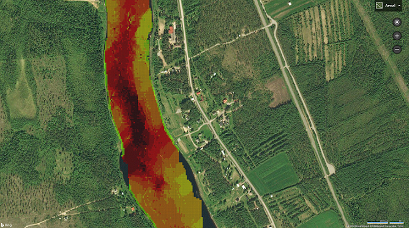

# ChartPlotterMap
> Map for Chartplotter project.
>__________________________________________
> To get a better understanding check
> [ChartPlotterLogger](https://github.com/Lassepitkanen/ChartplotterLogger)
> and
> [ChartPlotterProcessingML](https://github.com/Lassepitkanen/ChartplotterProcessingML)
___________________________________________

### What it does
Draws polygons representing water depth.